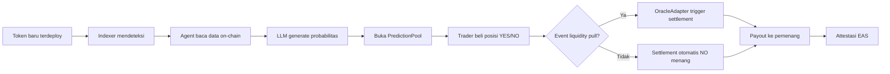

# Rug Radar — High-Level Architecture

**Versi:** 1.0
**Tanggal:** 13 Juli 2026

---

## System Overview

Rug Radar adalah sistem prediksi rug-pull untuk token baru di Base. Sistem menggabungkan AI agent dengan on-chain prediction market: agent membaca data on-chain token baru, menghasilkan skor probabilitas rug-pull via LLM, lalu membuka pool prediksi YES/NO. Settlement dilakukan murni berdasarkan event on-chain (liquidity pull), bukan opini AI.

```
┌─────────────────────────────────────────────────────────┐
│                     Off-Chain                            │
│  ┌──────────┐  ┌───────────┐  ┌─────────────────────┐  │
│  │ Indexer  │  │ AI Agent  │  │ Backend API         │  │
│  │ (read    │──│ (LangGraph │  │ (NestJS, Clean Arch)│  │
│  │  chain)  │  │  + LLM)   │  │                     │  │
│  └──────────┘  └─────┬─────┘  └─────────────────────┘  │
│                       │                                  │
├───────────────────────┼──────────────────────────────────┤
│                 On-Chain (Base)                          │
│  ┌────────────────────┴─────────────────────────────┐   │
│  │              PredictionPool Contract              │   │
│  │  ┌──────────┐  ┌────────────┐  ┌──────────────┐ │   │
│  │  │ Treasury │  │ Oracle     │  │ RiskRegistry │ │   │
│  │  │          │  │ Adapter    │  │              │ │   │
│  │  └──────────┘  └────────────┘  └──────────────┘ │   │
│  └──────────────────────────────────────────────────┘   │
└─────────────────────────────────────────────────────────┘
```

## On-Chain vs Off-Chain Boundary

| Ranah | Komponen | Bertanggung Jawab |
|-------|----------|-------------------|
| **On-Chain** | PredictionPool | Menerima posisi, settlement otomatis |
| **On-Chain** | OracleAdapter | Menyediakan data resolusi berbasis event |
| **On-Chain** | Treasury | Mengelola dana protokol |
| **On-Chain** | RiskRegistry | Menyimpan skor risiko token |
| **Off-Chain** | AI Agent | Deteksi token, generate skor via LLM |
| **Off-Chain** | Indexer | Baca bytecode, state liquidity, holder |
| **Off-Chain** | Backend API | Antarmuka pengguna, dashboard |

=> **Aturan inti:** AI agent TIDAK pernah mengeksekusi settlement. Settlement hanya dipicu oleh event on-chain (Oracle).

## Event Flow



## Komponen Utama

1. **PredictionPool** — Kontrak inti untuk setiap token. Menampung posisi YES/NO, melakukan settlement otomatis.
2. **OracleAdapter** — Menyediakan data resolusi dari event on-chain (liquidity pull). Satu-satunya pemicu settlement.
3. **Treasury** — Mengelola fee protokol, payout, dan dana cadangan.
4. **RiskRegistry** — Menyimpan skor risiko per token (probability + assessmentId).
5. **AI Agent** — Pipeline off-chain: deteksi → baca kontrak → LLM → buka pool.
6. **Indexer** — Membaca data on-chain (bytecode, liquidity pool state, holder distribution).
7. **AttestationAdapter** — Mencatat hasil settlement ke EAS untuk track record agent.
