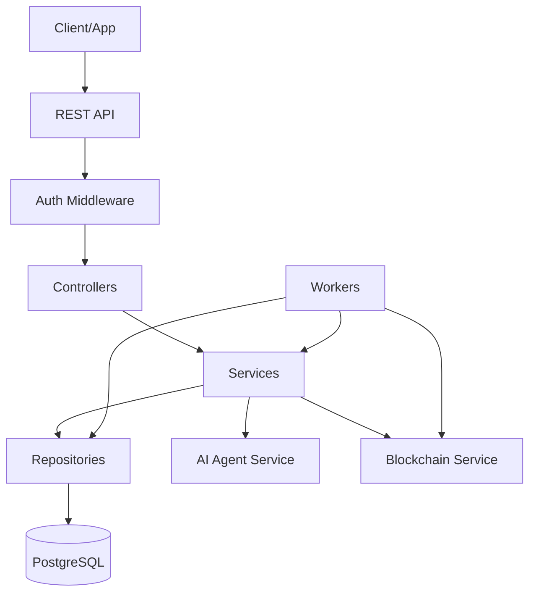

# Rug Radar — Backend Architecture

**Versi:** 1.0
**Tanggal:** 13 Juli 2026

---

## Clean Architecture Layers

```
┌──────────────────────────────────────────────────┐
│                  Controllers                      │
│  (HTTP handlers, validation, response format)     │
├──────────────────────────────────────────────────┤
│                  Services                         │
│  (Business logic, orchestration)                  │
├──────────────────────────────────────────────────┤
│                  Repositories                     │
│  (Data access, query abstraction)                 │
├──────────────────────────────────────────────────┤
│                  Workers                          │
│  (Background jobs, event consumers)               │
└──────────────────────────────────────────────────┘
```

## Dependency Rule

**Hanya layer luar yang bergantung ke layer dalam.** Controller → Service → Repository. Worker dapat mengakses Service dan Repository secara langsung. Tidak ada layer dalam yang bergantung ke layer luar.

## Module Structure

```
src/
├── modules/
│   ├── token/              # Deteksi & pembacaan token
│   │   ├── controllers/
│   │   ├── services/
│   │   └── repositories/
│   ├── assessment/         # Skor risiko AI
│   │   ├── controllers/
│   │   ├── services/
│   │   └── repositories/
│   ├── prediction/         # Pool prediksi & posisi
│   │   ├── controllers/
│   │   ├── services/
│   │   └── repositories/
│   ├── oracle/             # Data resolusi on-chain
│   │   ├── controllers/
│   │   ├── services/
│   │   └── repositories/
│   └── attestation/        # EAS attestation
│       ├── controllers/
│       ├── services/
│       └── repositories/
├── common/
│   ├── middleware/          # Auth, rate limit, logging
│   ├── errors/             # Custom error classes
│   ├── events/             # Event bus & handler
│   └── utils/              # Helpers
├── workers/
│   ├── token-detector.ts   # Polling token baru
│   ├── settlement.ts       # Settlement finalizer
│   └── attestation.ts      # EAS submission
└── main.ts                 # Entry point
```

## Component Responsibilities

| Layer | Tanggung Jawab |
|-------|---------------|
| **Controller** | Validasi input, format response, routing. Tidak ada logika bisnis. |
| **Service** | Semua logika bisnis. Orchestrasi antar repository dan external calls. |
| **Repository** | Abstraksi database query. Satu repository per entity. |
| **Worker** | Background job tanpa request context. Event-driven atau cron-based. |

## Mermaid Component Diagram


