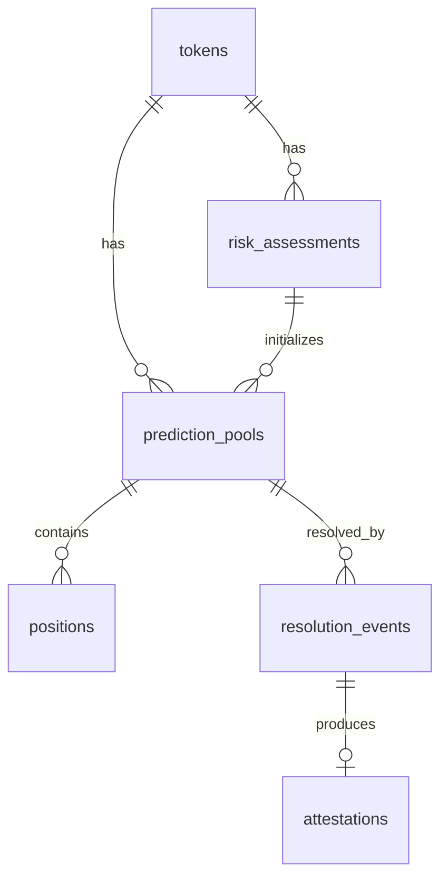

# Rug Radar — Database Architecture

**Versi:** 1.0
**Tanggal:** 13 Juli 2026

---

## Entities

### 1. `tokens`

| Kolom | Tipe | Keterangan |
|-------|------|-----------|
| id | UUID | PK |
| address | VARCHAR(42) | Alamat kontrak token, unique |
| chain_id | INTEGER | Base = 8453 |
| deployer | VARCHAR(42) | Alamat deployer |
| deployed_at | TIMESTAMP | Block timestamp |
| has_unlimited_mint | BOOLEAN | Dari bytecode analysis |
| has_blacklist | BOOLEAN | Dari bytecode analysis |
| has_tax | BOOLEAN | Dari bytecode analysis |
| liquidity_locked | BOOLEAN | Status LP lock |
| top_holder_concentration | DECIMAL(5,4) | % top 10 holder |
| created_at | TIMESTAMP | |
| updated_at | TIMESTAMP | |

### 2. `risk_assessments`

| Kolom | Tipe | Keterangan |
|-------|------|-----------|
| id | UUID | PK |
| token_id | UUID | FK → tokens.id |
| probability | DECIMAL(5,4) | 0.0000 - 1.0000 |
| reasoning | TEXT | Alasan dari LLM |
| confidence | DECIMAL(5,4) | 0.0000 - 1.0000 |
| llm_model | VARCHAR(50) | Model yang digunakan |
| assessed_at | TIMESTAMP | |
| created_at | TIMESTAMP | |

### 3. `prediction_pools`

| Kolom | Tipe | Keterangan |
|-------|------|-----------|
| id | UUID | PK |
| token_id | UUID | FK → tokens.id |
| assessment_id | UUID | FK → risk_assessments.id |
| contract_address | VARCHAR(42) | Alamat kontrak pool |
| yes_pool_amount | DECIMAL(40,0) | Total YES position |
| no_pool_amount | DECIMAL(40,0) | Total NO position |
| status | VARCHAR(20) | active / resolved / expired |
| deadline | TIMESTAMP | Batas waktu prediksi |
| created_at | TIMESTAMP | |
| resolved_at | TIMESTAMP | Nullable |

### 4. `positions`

| Kolom | Tipe | Keterangan |
|-------|------|-----------|
| id | UUID | PK |
| pool_id | UUID | FK → prediction_pools.id |
| user_address | VARCHAR(42) | Alamat trader |
| side | VARCHAR(3) | YES / NO |
| amount | DECIMAL(40,0) | Jumlah posisi |
| claimed | BOOLEAN | Apakah sudah claim |
| created_at | TIMESTAMP | |

### 5. `resolution_events`

| Kolom | Tipe | Keterangan |
|-------|------|-----------|
| id | UUID | PK |
| pool_id | UUID | FK → prediction_pools.id |
| liquidity_pulled | BOOLEAN | Apakah LP ditarik? |
| winning_side | VARCHAR(3) | YES / NO |
| tx_hash | VARCHAR(66) | Hash transaksi settlement |
| resolved_at | TIMESTAMP | |

### 6. `attestations`

| Kolom | Tipe | Keterangan |
|-------|------|-----------|
| id | UUID | PK |
| pool_id | UUID | FK → prediction_pools.id |
| eas_uid | VARCHAR(66) | UID attestation EAS |
| predicted_outcome | BOOLEAN | Prediksi agent |
| actual_outcome | BOOLEAN | Hasil aktual |
| attested_at | TIMESTAMP | |

## Relationships

## Indexes

| Tabel | Index | Alasan |
|-------|-------|--------|
| tokens | address + chain_id | Unique lookup |
| tokens | deployed_at | Sorting token baru |
| risk_assessments | token_id | Cepat ambil assessment terbaru |
| prediction_pools | status | Filter pool aktif |
| prediction_pools | deadline | Expired pool detection |
| positions | pool_id + user_address | Cek posisi user |
| positions | user_address | Dashboard user |
| resolution_events | pool_id | Lookup hasil |

## Migration Strategy

- **Tool:** TypeORM migrations
- **Naming:** `YYYYMMDDHHMMSS-description.ts`
- **Policy:** Hanya additive migration di fase awal (add column, add table). Tidak ada destructive migration tanpa review.
- **Rollback:** Setiap migration wajib punya `down()` method.
