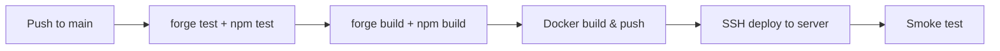

# Rug Radar — Deployment Architecture

**Versi:** 1.0
**Tanggal:** 13 Juli 2026

---

## Local Development

```bash
# Prerequisites
- Node.js 20+
- PostgreSQL 16+
- Foundry (forge, cast, anvil)
- Docker (optional)

# Setup
cp .env.example .env
npm install
forge install
npm run dev        # Backend (NestJS hot reload)
anvil              # Local chain (port 8545)
forge script script/DeployLocal.s.sol --rpc-url localhost:8545
```

## Docker

```dockerfile
# Production image
FROM node:20-alpine AS backend
WORKDIR /app
COPY package*.json ./
RUN npm ci --only=production
COPY dist/ .

FROM alpine:3.19 AS contracts
RUN apk add --no-cache curl
COPY --from=ghcr.io/foundry-rs/foundry:latest /usr/local/bin/forge /usr/local/bin/
COPY contracts/ ./contracts/

# docker-compose.yml
services:
  backend:    build: ./backend
  postgres:   image: postgres:16-alpine
  redis:      image: redis:7-alpine
  anvil:      image: ghcr.io/foundry-rs/foundry:latest
```

## Environment Variables

| Variable | Deskripsi |
|----------|-----------|
| `NODE_ENV` | development / production |
| `DATABASE_URL` | PostgreSQL connection string |
| `REDIS_URL` | Redis connection string |
| `RPC_URL` | Base RPC endpoint |
| `LLM_API_KEY` | API key untuk LLM provider |
| `LLM_MODEL` | Model name (e.g., gpt-4o) |
| `EAS_CONTRACT_ADDRESS` | Alamat EAS contract |
| `PRIVATE_KEY` | Deployer private key (CI only) |
| `API_KEY_SALT` | Salt untuk hashing API key |

## Production Deployment

- **Host:** Docker container on VPS / cloud
- **Reverse proxy:** Nginx + SSL
- **Database:** Managed PostgreSQL (RDS / Cloud SQL)
- **Queue:** Redis / RabbitMQ managed service
- **Chain:** Base Mainnet via archive node RPC

## CI/CD Pipeline



- **Platform:** GitHub Actions
- **Environments:** staging (Base Sepolia) → production (Base Mainnet)
- **Deployment strategy:** Rolling update (downtime < 10s)

## Monitoring

| Tool | Kegunaan |
|------|----------|
| Sentry | Error tracking backend |
| Prometheus + Grafana | Metrics: request rate, latency, errors |
| On-chain events | Blockchain explorer (Basescan) |

## Logging

- **Format:** JSON structured logging
- **Level:** debug (dev), info (prod), warn, error
- **Output:** stdout (container), file (local)
- **Sensitive data:** Jangan log API keys, private keys, password

## Health Checks

| Endpoint | Deskripsi |
|----------|-----------|
| `/health` | Basic alive check |
| `/health/ready` | Dependencies ready (DB, Redis, RPC) |
| `/health/chain` | RPC connection & latest block |
