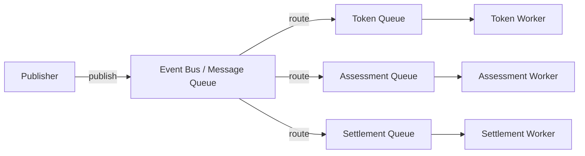

# Rug Radar — Event Architecture

**Versi:** 1.0
**Tanggal:** 13 Juli 2026

---

## Domain Events

| Event | Publisher | Subscriber | Payload |
|-------|-----------|------------|---------|
| `TokenDetected` | Token Detector Worker | AI Agent Service | `{address, chainId, deployedAt, deployer}` |
| `DataCollected` | AI Agent Service | Assessment Service | `{tokenAddress, riskFunctions[], liquidityLocked, topHolderConcentration}` |
| `AssessmentCompleted` | Assessment Service | Pool Service | `{tokenAddress, probability, reasoning, confidence, assessmentId}` |
| `PoolCreated` | Web3 Service | Indexer / Notifier | `{poolId, tokenAddress, contractAddress, initialOdds}` |
| `PositionPurchased` | PredictionPool (on-chain) | Backend Sync Worker | `{poolId, user, side, amount, txHash}` |
| `LiquidityPullDetected` | Oracle Worker | Settlement Service | `{poolId, tokenAddress, txHash}` |
| `PoolSettled` | Settlement Service | Attestation Service | `{poolId, winningSide, totalYes, totalNo}` |
| `AttestationCompleted` | Attestation Service | — | `{poolId, easUid, predictedOutcome, actualOutcome}` |
| `SettlementFailed` | Settlement Service | Alert / Admin | `{poolId, reason, txHash}` |

## Event Payload Convention

Setiap event memiliki format dasar:

```typescript
interface DomainEvent<T> {
  id: string;           // UUID
  type: string;         // Nama event
  version: number;      // Versi payload
  timestamp: string;    // ISO 8601
  source: string;       // Nama service publisher
  data: T;              // Payload spesifik event
  correlationId: string;// Untuk tracing end-to-end
}
```

## Queue Architecture



- **Broker:** RabbitMQ (fase awal) / Redis Streams (alternatif lightweight)
- **Queue per event type:** Hindari shared queue untuk isolation
- **Delivery:** At-least-once delivery

## Retry Policy

| Skenario | Max Retry | Backoff | Action Setelah Gagal |
|----------|-----------|---------|---------------------|
| Network timeout | 3 | 5s, 15s, 30s | Log + alert |
| LLM error | 2 | 10s, 30s | Fallback probability 0.5 |
| RPC error | 3 | 2s, 5s, 10s | Queue ke cycle berikutnya |
| DB error | 3 | 1s, 2s, 5s | Retry, lalu fail |

## Dead-Letter Queue (DLQ)

Event yang tetap gagal setelah semua retry akan masuk ke DLQ:

- **Routing:** `{queue-name}.dlq`
- **Retention:** 7 hari
- **Monitoring:** Alert setiap ada event masuk DLQ
- **Manual replay:** Via admin panel (trigger re-publish)
