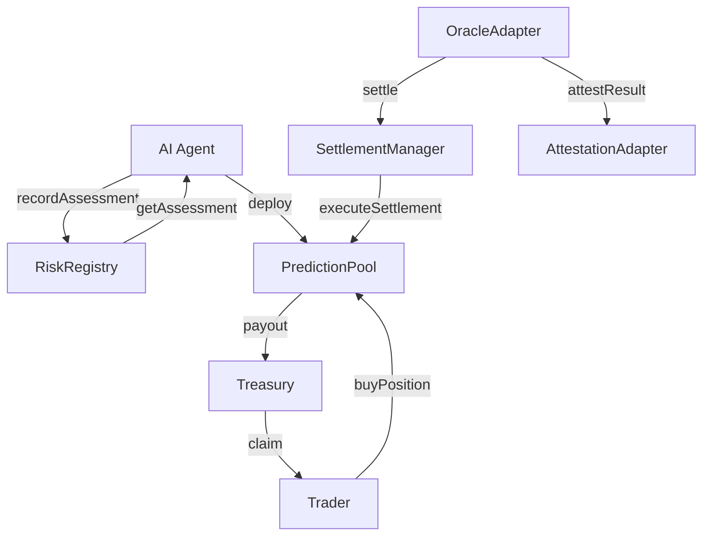

# Rug Radar — Smart Contract Architecture

**Versi:** 1.0
**Tanggal:** 13 Juli 2026

---

## Contracts

### 1. PredictionPool

Kontrak inti. Setiap token baru mendapat satu instance PredictionPool. Menerima deposit posisi YES/NO dari trader, melakukan settlement otomatis berdasarkan pemicu dari OracleAdapter.

```
PredictionPool
├── buyPosition(side, amount)   — Beli posisi YES (true) atau NO (false)
├── settle(outcome)             — Hanya dipanggil OracleAdapter
├── claim(user)                 — Klaim payout setelah settlement
└── poolId, yesPool, noPool, status, deadline
```

- **Ownership:** Ownable2Step (owner = Rug Radar deployer)
- **Access:** OracleAdapter memiliki akses ke `settle()`
- **Events:** `PoolCreated`, `PositionPurchased`, `PoolResolved`, `SettlementExecuted`

### 2. SettlementManager

Mengelola jadwal settlement dan memastikan finality. Single contract yang mengatur kapan pool bisa di-settle dan memvalidasi data oracle.

```
SettlementManager
├── scheduleSettlement(poolId, deadline)
├── executeSettlement(poolId, data) — via OracleAdapter
└── getSettlementStatus(poolId)
```

### 3. OracleAdapter

Satu-satunya contract yang bisa memicu settlement. Membaca event liquidity-pull dari chain dan mengirimkan data resolusi ke PredictionPool.

```
OracleAdapter
├── reportLiquidityPull(poolId, tokenAddress, proof)
├── isResolved(poolId) → bool
└── getResolutionData(poolId) → ResolutionData
```

- **Access:** Only owner (atau trusted relayer) untuk submit data
- **Events:** `ResolutionReported`

### 4. Treasury

Mengelola dana protokol. Menerima fee dari setiap posisi, melakukan payout ke pemenang.

```
Treasury
├── deposit(poolId, amount)
├── payout(winner, amount)
├── withdrawFees(to, amount) — hanya owner
└── balance(poolId) → uint256
```

### 5. RiskRegistry

Menyimpan skor risiko per token. Hanya diisi oleh AI Agent (via backend). Bersifat immutable setelah ditulis — tidak bisa diubah untuk token yang sama.

```
RiskRegistry
├── recordAssessment(tokenAddress, probability, assessmentId)
├── getAssessment(tokenAddress) → RiskAssessment
└── assessmentCount() → uint256
```

### 6. AttestationAdapter

Mencatat hasil settlement ke EAS (Ethereum Attestation Service). Memberikan track record on-chain agent.

```
AttestationAdapter
├── attestResult(poolId, predictedOutcome, actualOutcome)
└── getAttestation(poolId) → Attestation
```

## Ownership & Access Control

| Contract | Ownership | Special Roles |
|----------|-----------|---------------|
| PredictionPool | Ownable2Step | OracleAdapter (access to settle) |
| SettlementManager | Ownable2Step | — |
| OracleAdapter | Ownable2Step | Relayers (optional) |
| Treasury | Ownable2Step | — |
| RiskRegistry | Ownable2Step | — |
| AttestationAdapter | Ownable2Step | — |

## Contract Interaction Diagram


