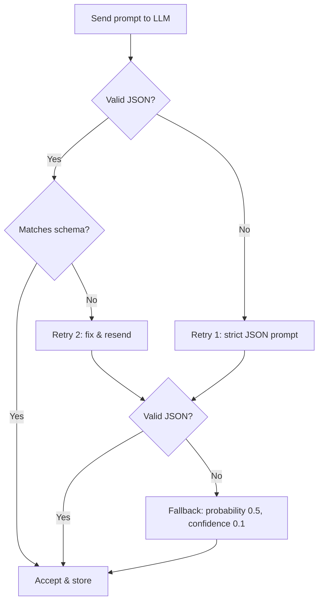

# Rug Radar — Prompt Lifecycle

**Versi:** 1.0.0
**Tanggal:** 13 Juli 2026

---

## Complete Lifecycle

```
Blockchain → Collect → Sanitize → Prompt → LLM → Parse → Validate → Store → Act
```

| Step | Component | Description |
|------|-----------|-------------|
| 1. **Blockchain** | Indexer | Token baru terdeteksi di Base |
| 2. **Collect** | Data Collector | Baca bytecode, liquidity, holder dari RPC |
| 3. **Sanitize** | Sanitizer | Bersihkan data dari potensi injection |
| 4. **Prompt** | Prompt Builder | Susun data ke dalam template prompt |
| 5. **LLM** | AI Service | Kirim prompt ke LLM, dapatkan response |
| 6. **Parse** | Parser | Parse JSON dari LLM response |
| 7. **Validate** | Validator | Validasi terhadap output-schema |
| 8. **Store** | Repository | Simpan assessment ke database |
| 9. **Act** | Pool Service | Buka prediction pool dengan hasil assessment |

## Blockchain Data → AI Input

```typescript
interface BlockchainData {
  address: string;
  chain: string;
  deployer: string;
  deployedAt: string;
  riskFunctions: {
    hasUnlimitedMint: boolean | null;
    hasBlacklist: boolean | null;
    hasTax: boolean | null;
  };
  liquidity: {
    locked: boolean | null;
    usdValue: number | null;
  };
  holders: {
    topConcentration: number | null;
  };
}
```

Setiap field `null` berarti data tidak tersedia dan akan di-omit dari prompt.

## Validation Before Persistence

```typescript
function validateAndStore(assessment: LLMOutput): Assessment {
  // 1. Schema validation
  const valid = validateSchema(assessment);
  if (!valid) throw new ValidationError('Schema mismatch');

  // 2. Range validation
  if (assessment.probability < 0 || assessment.probability > 1) {
    throw new ValidationError('Probability out of range');
  }

  // 3. Confidence validation
  if (assessment.confidence < 0 || assessment.confidence > 1) {
    throw new ValidationError('Confidence out of range');
  }

  // 4. Reasoning length
  assessment.reasoning = assessment.reasoning.substring(0, 200);

  // 5. Filter unknown risk factors
  assessment.riskFactors = assessment.riskFactors.filter(f =>
    ALLOWED_RISK_FACTORS.includes(f)
  );

  // 6. Save to database
  return assessmentRepository.save(assessment);
}
```

## Retry Strategy



| Attempt | Action |
|---------|--------|
| 1st | Standard prompt |
| 2nd (retry 1) | Prompt + "Respond with ONLY valid JSON" |
| 3rd (retry 2) | Prompt + "RESPOND WITH ONLY VALID JSON. NO OTHER TEXT." |
| Fallback | probability=0.5, confidence=0.1, reasoning="LLM failed to respond correctly" |

## Failure Handling

| Failure Mode | Action | Alert? |
|-------------|--------|--------|
| LLM timeout (>15s) | Retry 2x, fallback | No (rate > 5% → yes) |
| LLM rate limit | Exponential backoff (30s, 60s, 120s) | No |
| JSON parse fail (3x) | Fallback assessment | Yes |
| Schema validation fail (3x) | Fallback assessment | Yes |
| Empty response | Fallback assessment | Yes |
| API key expired | Stop all assessments, alert admin | Critical |
| RPC failure (3x) | Skip token, retry next cycle | No |
| DB failure | Retry 3x, then DLQ | Yes |

Fallback assessment:
```json
{
  "probability": 0.5,
  "reasoning": "Assessment failed due to LLM error. Defaulting to neutral risk.",
  "confidence": 0.1,
  "riskFactors": ["insufficient_data"]
}
```
