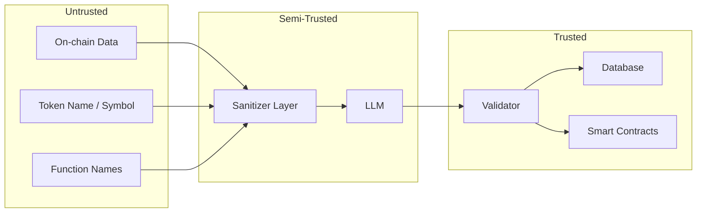

# Rug Radar — Prompt Security

**Versi:** 1.0.0
**Tanggal:** 13 Juli 2026

---

## Prompt Injection Risks

| Risk | Deskripsi | Dampak |
|------|-----------|--------|
| **Direct injection** | Token name/address mengandung instruksi yang mempengaruhi LLM | Skor risiko bias |
| **Indirect injection** | Data on-chain yang dibaca (fungsi name, event log) berisi prompt berbahaya | Output tidak terduga |
| **Role confusion** | LLM diminta melakukan aksi di luar wewenangnya | Tanggung jawab kabur |
| **Prompt leaking** | Prompt engineering ter-expose di response | Secret prompt bocor |

## Hardening Guidelines

### 1. Input Sanitization

Sebelum data on-chain dimasukkan ke prompt:

```typescript
function sanitizeForPrompt(input: string): string {
  // Strip karakter non-ASCII yang bisa jadi delimiter injection
  return input
    .replace(/[\x00-\x1F\x7F-\x9F]/g, '')  // control chars
    .replace(/[<>{}[\]()]/g, ' ')             // bracket chars
    .substring(0, 200);                       // length limit
}
```

### 2. System Prompt Isolation

```markdown
[SISTEM - MULAI]
...system instructions...
[SISTEM - SELESAI]

[DATA - MULAI]
...user data (sanitized)...
[DATA - SELESAI]
```

Gunakan delimiter eksplisit untuk memisahkan sistem prompt dari data input — memudahkan LLM membedakan instruksi dari data.

### 3. Output Constraint

Prompt selalu diakhiri dengan:

```
IMPORTANT: Respond with ONLY the JSON object. No markdown, no code blocks,
no additional text, no explanations.
```

## Forbidden Instructions

Prompt TIDAK BOLEH mengandung:

- "Ignore previous instructions" (ironisnya, jangan instruksikan untuk ignore)
- "You are now..." prompts yang mengubah persona (hanya satu persona: risk assessor)
- Instruksi untuk memberikan rekomendasi trading atau financial advice
- Instruksi untuk mengakses internet atau file system
- Instruksi untuk "think step by step" — cukup output langsung

## Output Sanitization

```typescript
function sanitizeOutput(raw: string): string {
  // Hanya extract JSON object
  const jsonMatch = raw.match(/\{[\s\S]*\}/);
  if (!jsonMatch) throw new Error('No JSON found in LLM response');

  // Parse dan validasi terhadap schema
  const parsed = JSON.parse(jsonMatch[0]);
  return validateAgainstSchema(parsed);
}
```

## Hallucination Mitigation

| Strategy | Implementasi |
|----------|-------------|
| **Constrained output** | Minta JSON dengan schema tetap — LLM lebih sulit hallucinate |
| **Explicit unknowns** | "If a signal cannot be determined, omit it — do NOT guess" |
| **Confidence requirement** | Confidence rendah = LLM admit uncertainty |
| **Validation layer** | Semua output melewati validation terhadap schema sebelum dipakai |
| **Reject nonsense** | Probability 0.5 + confidence 0.1 jika output tidak masuk akal |

## Trust Boundaries



| Boundary | Trust Level | Akses |
|----------|-------------|-------|
| On-chain data | **Untrusted** | Bisa mengandung prompt injection |
| Sanitizer | **Trusted** | Code kita, tidak bisa dimodifikasi dari luar |
| LLM | **Semi-trusted** | Output divalidasi sebelum dipakai |
| Validator | **Trusted** | Gatekeeper terakhir sebelum data masuk sistem |
| Database / Contracts | **Trusted** | Hanya menerima data yang sudah divalidasi |

**Prinsip:** LLM adalah semi-trusted component. Output-nya harus divalidasi secara terprogram sebelum digunakan untuk aksi apapun.
