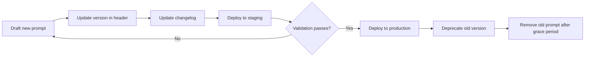

# Rug Radar — Prompt Versioning

**Versi:** 1.0.0
**Tanggal:** 13 Juli 2026

---

## Strategy

Prompt di-version menggunakan **semantic versioning (MAJOR.MINOR.PATCH)**:

| Bump | When | Example |
|------|------|---------|
| **MAJOR** | Breaking change: input field removed, output schema change, behavior change | 1.0.0 → 2.0.0 |
| **MINOR** | New input field added (backward compatible), new risk factor enum value | 1.0.0 → 1.1.0 |
| **PATCH** | Wording change, typo fix, example update (no functional change) | 1.0.0 → 1.0.1 |

## File Naming Convention

Prompt files menggunakan format: `{name}-v{MAJOR}.{MINOR}.md`

Namun untuk kemudahan referensi, file di repo menggunakan nama tanpa version — versi dicatat di header file dan di CHANGELOG.

```
docs/prompts/
├── README.md
├── risk-analysis.md         # Header: v1.0.0
├── output-schema.md         # Header: v1.0.0
├── versioning.md
├── security.md
├── evaluation.md
├── examples.md
└── lifecycle.md
```

## Version Tracking

Setiap prompt file mencantumkan:
- **Version** di header (YAML frontmatter atau markdown heading)
- **Changelog** inline di bagian bawah file
- **Compatibility note** jika ada breaking change

## Backward Compatibility

| Change | Compatible? | Migration Required? |
|--------|------------|-------------------|
| Add new input field | Yes | No |
| Add new enum value to riskFactors | Yes | No |
| Change output field name | No | Yes — update parser |
| Remove input field | No | Yes — update collector |
| Change prompt wording | Yes (usually) | No |
| Stricter validation | No | Yes — update validator |

**Rule:** Selama output JSON schema tidak berubah (field names, types, required), perubahan dianggap backward compatible.

## Prompt Migration Process



1. **Draft** — Buat prompt baru / modifikasi prompt existing
2. **Version bump** — Update version sesuai semantic versioning
3. **Changelog** — Catat perubahan di bagian changelog file
4. **Staging** — Deploy ke environment staging, test output
5. **Validation** — Bandingkan output dengan baseline test cases
6. **Production** — Jika validation pass, deploy ke production
7. **Deprecation** — Prompt lama tetap ada 7 hari, lalu dihapus

## Changelog Format

Setiap prompt file memiliki changelog di bagian bawah:

```markdown
## Changelog

### 1.0.0 (2026-07-13)
- Initial release
```
