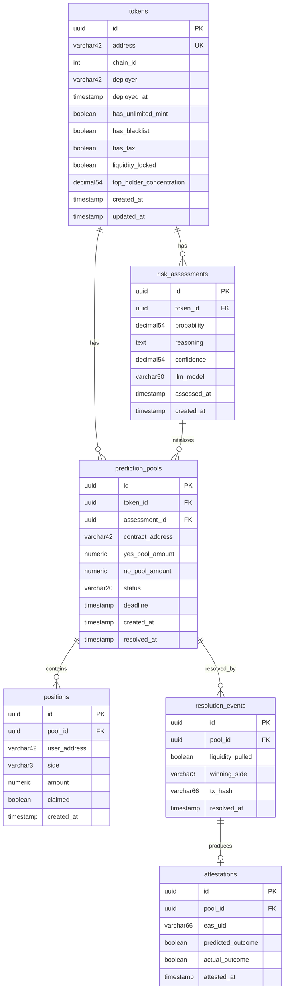

# Rug Radar — Database Schema Specification

**Versi:** 1.0
**Tanggal:** 13 Juli 2026

---

## Entity-Relationship Diagram

---

## Table: `tokens`

| Column | Type | Constraints | Default | Description |
|--------|------|-------------|---------|-------------|
| `id` | `uuid` | `PRIMARY KEY` | `gen_random_uuid()` | Unique identifier |
| `address` | `varchar(42)` | `NOT NULL`, `UNIQUE` | — | Alamat kontrak token (0x...) |
| `chain_id` | `integer` | `NOT NULL` | `8453` | Chain ID (Base = 8453) |
| `deployer` | `varchar(42)` | `NOT NULL` | — | Alamat deployer |
| `deployed_at` | `timestamptz` | `NOT NULL` | — | Block timestamp deploy |
| `has_unlimited_mint` | `boolean` | — | `NULL` | Ada fungsi mint unlimited? |
| `has_blacklist` | `boolean` | — | `NULL` | Ada fungsi blacklist? |
| `has_tax` | `boolean` | — | `NULL` | Ada fee transfer? |
| `liquidity_locked` | `boolean` | — | `NULL` | Apakah LP terkunci? |
| `top_holder_concentration` | `decimal(5,4)` | — | `NULL` | % top 10 holder (0.0000-1.0000) |
| `created_at` | `timestamptz` | `NOT NULL` | `now()` | |
| `updated_at` | `timestamptz` | `NOT NULL` | `now()` | |

**Indexes:** `address` UNIQUE, `deployed_at` DESC, `(chain_id, address)` UNIQUE

---

## Table: `risk_assessments`

| Column | Type | Constraints | Default | Description |
|--------|------|-------------|---------|-------------|
| `id` | `uuid` | `PRIMARY KEY` | `gen_random_uuid()` | |
| `token_id` | `uuid` | `NOT NULL`, `FK → tokens(id)` | — | Token yang dinilai |
| `probability` | `decimal(5,4)` | `NOT NULL` | — | Probabilitas rug-pull (0.0-1.0) |
| `reasoning` | `text` | `NOT NULL` | — | Alasan dari LLM |
| `confidence` | `decimal(5,4)` | `NOT NULL` | — | Confidence (0.0-1.0) |
| `llm_model` | `varchar(50)` | `NOT NULL` | — | Model LLM yang digunakan |
| `assessed_at` | `timestamptz` | `NOT NULL` | — | Waktu assessment |
| `created_at` | `timestamptz` | `NOT NULL` | `now()` | |

**Indexes:** `token_id`, `(token_id, assessed_at DESC)`

**Cascade:** `ON DELETE CASCADE` (assessment dihapus jika token dihapus)

---

## Table: `prediction_pools`

| Column | Type | Constraints | Default | Description |
|--------|------|-------------|---------|-------------|
| `id` | `uuid` | `PRIMARY KEY` | `gen_random_uuid()` | |
| `token_id` | `uuid` | `NOT NULL`, `FK → tokens(id)` | — | Token terkait |
| `assessment_id` | `uuid` | `NOT NULL`, `FK → risk_assessments(id)` | — | Assessment yang memicu pool |
| `contract_address` | `varchar(42)` | `NOT NULL`, `UNIQUE` | — | Alamat kontrak pool di-chain |
| `yes_pool_amount` | `numeric(40,0)` | `NOT NULL` | `0` | Total YES dalam wei |
| `no_pool_amount` | `numeric(40,0)` | `NOT NULL` | `0` | Total NO dalam wei |
| `status` | `varchar(20)` | `NOT NULL` | `'active'` | active / resolved / expired |
| `deadline` | `timestamptz` | `NOT NULL` | — | Batas waktu prediksi |
| `created_at` | `timestamptz` | `NOT NULL` | `now()` | |
| `resolved_at` | `timestamptz` | — | `NULL` | Waktu resolusi |

**Constraints:** `CHECK (status IN ('active', 'resolved', 'expired'))`

**Indexes:** `token_id`, `status`, `deadline`, `contract_address` UNIQUE

---

## Table: `positions`

| Column | Type | Constraints | Default | Description |
|--------|------|-------------|---------|-------------|
| `id` | `uuid` | `PRIMARY KEY` | `gen_random_uuid()` | |
| `pool_id` | `uuid` | `NOT NULL`, `FK → prediction_pools(id)` | — | Pool terkait |
| `user_address` | `varchar(42)` | `NOT NULL` | — | Alamat trader |
| `side` | `varchar(3)` | `NOT NULL` | — | YES / NO |
| `amount` | `numeric(40,0)` | `NOT NULL` | — | Jumlah posisi dalam wei |
| `claimed` | `boolean` | `NOT NULL` | `false` | Apakah sudah claim payout? |
| `created_at` | `timestamptz` | `NOT NULL` | `now()` | |

**Constraints:** `CHECK (side IN ('YES', 'NO'))`, `CHECK (amount > 0)`

**Indexes:** `(pool_id, user_address)` UNIQUE, `user_address`, `pool_id`

**Cascade:** `ON DELETE CASCADE` jika pool dihapus

---

## Table: `resolution_events`

| Column | Type | Constraints | Default | Description |
|--------|------|-------------|---------|-------------|
| `id` | `uuid` | `PRIMARY KEY` | `gen_random_uuid()` | |
| `pool_id` | `uuid` | `NOT NULL`, `FK → prediction_pools(id)`, `UNIQUE` | — | Pool yang di-resolve |
| `liquidity_pulled` | `boolean` | `NOT NULL` | — | Apakah LP ditarik? |
| `winning_side` | `varchar(3)` | `NOT NULL` | — | YES / NO |
| `tx_hash` | `varchar(66)` | `NOT NULL` | — | Transaksi settlement |
| `resolved_at` | `timestamptz` | `NOT NULL` | `now()` | |

**Constraints:** `CHECK (winning_side IN ('YES', 'NO'))`

**Indexes:** `pool_id` UNIQUE

---

## Table: `attestations`

| Column | Type | Constraints | Default | Description |
|--------|------|-------------|---------|-------------|
| `id` | `uuid` | `PRIMARY KEY` | `gen_random_uuid()` | |
| `pool_id` | `uuid` | `NOT NULL`, `FK → resolution_events(pool_id)`, `UNIQUE` | — | Pool yang di-attest |
| `eas_uid` | `varchar(66)` | `NOT NULL`, `UNIQUE` | — | UID attestation EAS |
| `predicted_outcome` | `boolean` | `NOT NULL` | — | Prediksi agent (YES/NO) |
| `actual_outcome` | `boolean` | `NOT NULL` | — | Hasil aktual |
| `attested_at` | `timestamptz` | `NOT NULL` | `now()` | |

**Indexes:** `pool_id` UNIQUE, `eas_uid` UNIQUE

---

## Cascade Rules

| Parent | Child | On Delete |
|--------|-------|-----------|
| `tokens` | `risk_assessments` | `CASCADE` |
| `tokens` | `prediction_pools` | `CASCADE` |
| `risk_assessments` | `prediction_pools` | `RESTRICT` |
| `prediction_pools` | `positions` | `CASCADE` |
| `prediction_pools` | `resolution_events` | `CASCADE` |
| `resolution_events` | `attestations` | `CASCADE` |

---

## Migration Strategy

- **Tool:** TypeORM migrations
- **Naming:** `YYYYMMDDHHMMSS-description.ts`
- **Policy:** Additive only in MVP — no destructive migrations without review
- **Rollback:** Every migration MUST have `down()` method
- **Seed:** Not needed in MVP (data comes from live chain sync)
