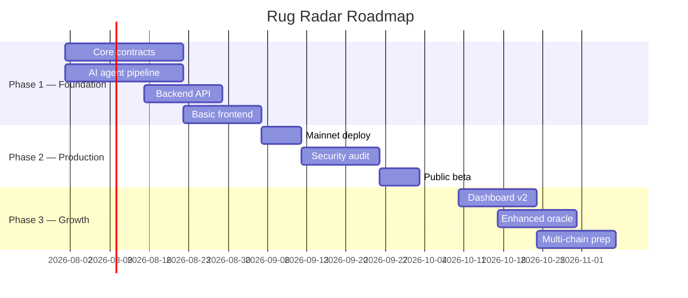

# Rug Radar — Project Roadmap

**Versi:** 1.0
**Tanggal:** 13 Juli 2026

---

## MVP Scope (Hackathon Deliverable)

**Goal:** Demo end-to-end yang bisa dipahami juri dalam ±3 menit.

| Feature | Status | Notes |
|---------|--------|-------|
| Token detection on Base Sepolia | ❌ Pending | Polling new deploy events |
| On-chain data reader (bytecode, liquidity, holders) | ❌ Pending | Via RPC calls |
| LLM risk assessment | ❌ Pending | Prompt defined, integration needed |
| PredictionPool contract | ❌ Pending | Core contract |
| Settlement via Oracle | ❌ Pending | Manual oracle for hackathon |
| Simple frontend (buy YES/NO) | ❌ Pending | Minimal UI |
| EAS attestation | ❌ Pending | On-chain record |
| Agent accuracy dashboard | ❌ Pending | Basic stats page |

### MVP Exclusions

- Multi-chain support (F12)
- Dispute/challenge mechanism (F13)
- ERC-4337 smart accounts
- Advanced oracle integrations
- Real-time notifications

**ponytail:** fitur di atas ditunda karena tidak esensial untuk demo hackathon. Add when: produk sudah live dan ada user request.

---

## Post-Hackathon Roadmap



## Milestones

| Milestone | Target Date | Deliverable |
|-----------|-------------|-------------|
| **M1: Hackathon Demo** | Hackathon date | End-to-end demo on Base Sepolia |
| **M2: Contract Audit** | Post-hackathon + 3w | Audited contracts on Base Sepolia |
| **M3: Mainnet Launch** | Audit + 1w | Live on Base Mainnet |
| **M4: Public Beta** | Launch + 1w | Open to all users |
| **M5: v1.0 Release** | Beta + 4w | Production-ready with monitoring |

## Technical Debt Backlog

| Item | Priority | Effort | Notes |
|------|----------|--------|-------|
| Error handling standardization | Medium | 1d | All errors use RR_* codes |
| Logging infrastructure | Medium | 2d | Structured JSON logging |
| Retry policy consistency | Low | 1d | Implement across all services |
| Test coverage < 80% | High | 3d | Unit + fuzz + invariant tests |
| Documentation sync | Low | 1d | Keep docs in sync with code |
| CI/CD pipelines | Medium | 2d | GitHub Actions |
| Monitoring & alerting | Medium | 2d | Sentry + health checks |
| Rate limiting middleware | High | 1d | Per-key rate limiting |
| Input sanitization | High | 1d | Sanitizer for AI prompts |

## Future Enhancements

```yaml
short_term:
  - description: "Agent accuracy dashboard"
    effort: 2d
    dependency: MVP live

  - description: "Email/webhook notifications for settlement"
    effort: 3d
    dependency: Backend complete

  - description: "Token price chart + liquidity history"
    effort: 5d
    dependency: Data indexed

medium_term:
  - description: "Multi-chain support (Ethereum, Arbitrum, Optimism)"
    effort: 3w
    dependency: Base stable

  - description: "Automated oracle with indexer"
    effort: 2w
    dependency: Oracle pattern proved

  - description: "Dispute mechanism with bonding"
    effort: 4w
    dependency: Community > 100 users

long_term:
  - description: "ERC-4337 smart accounts for gasless trading"
    effort: 3w
    dependency: Account abstraction mature

  - description: "Liquidity provider incentives"
    effort: 2w
    dependency: TVL > $100K

  - description: "On-chain governance for protocol parameters"
    effort: 4w
    dependency: Token launch (if any)
```

## Risk Register

| Risk | Impact | Probability | Mitigation |
|------|--------|------------|------------|
| LLM API cost too high | Medium | Low | Use mini model, cache results |
| Base network congestion | Low | Low | Adjust gas prices dynamically |
| Low user adoption | High | Medium | Focus on hackathon demo quality |
| Smart contract bug | Critical | Medium | Security audit + bug bounty |
| Oracle manipulation | High | Low | Trusted oracle source + verification |
| LLM hallucination | Medium | Medium | Strict output validation + schema |
