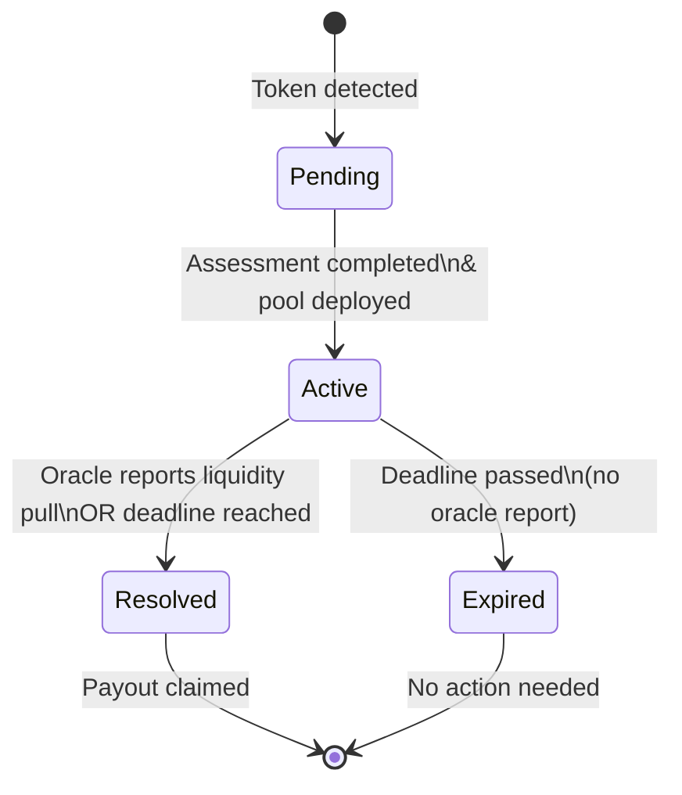
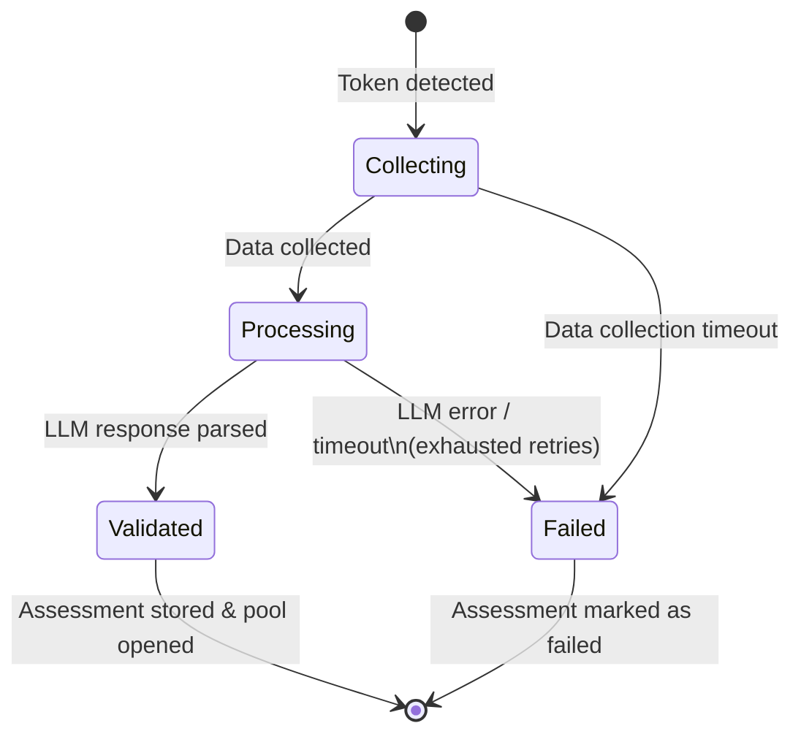
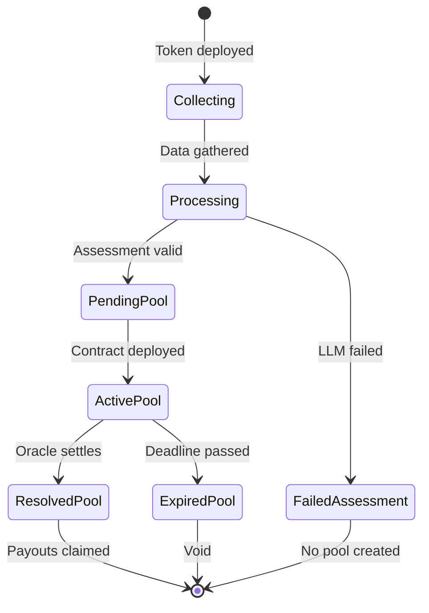

# Rug Radar — State Machine Specification

**Versi:** 1.0
**Tanggal:** 13 Juli 2026

---

## 1. Prediction Pool Lifecycle



### States

| State | Description |
|-------|-------------|
| **Pending** | Token terdeteksi, assessment sedang berlangsung. Pool belum aktif. |
| **Active** | Pool terbuka. Trader bisa membeli posisi YES/NO. |
| **Resolved** | Settlement selesai. Oracle telah memberikan data. Pemenang bisa claim. |
| **Expired** | Deadline terlampaui tanpa oracle report. Pool menjadi void (tidak ada payout). |

### Valid Transitions

| From | To | Trigger | Condition |
|------|----|---------|-----------|
| `Pending` | `Active` | Pool deployed | Assessment valid, contract address tersedia |
| `Active` | `Resolved` | Oracle report | OracleAdapter memanggil `settle()` |
| `Active` | `Expired` | Deadline passed | `block.timestamp > deadline` |
| `Active` | `Resolved` | Manual settlement | Deadline passed + owner force-settle (NO wins) |

### Invalid Transitions

| From | To | Reason |
|------|----|--------|
| `Pending` | `Resolved` | Pool belum aktif, tidak ada posisi |
| `Expired` | `Resolved` | Pool sudah expired, tidak bisa di-settle |
| `Resolved` | `Active` | Settlement bersifat final |
| `Resolved` | `Expired` | Settlement sudah dilakukan |

---

## 2. Risk Assessment Lifecycle



### States

| State | Description |
|-------|-------------|
| **Collecting** | Agent mengumpulkan data on-chain (bytecode, liquidity, holders). |
| **Processing** | Data dikirim ke LLM untuk sintesis probabilitas. |
| **Validated** | Output LLM valid sesuai schema. Siap digunakan. |
| **Failed** | Semua retry gagal. Assessment tidak bisa diselesaikan. |

### Valid Transitions

| From | To | Trigger |
|------|----|---------|
| `Collecting` | `Processing` | Semua data (atau timeout) terkumpul |
| `Processing` | `Validated` | LLM response valid dan OK |
| `Processing` | `Processing` | Retry (jika response invalid) |
| `Processing` | `Failed` | Semua retry gagal |
| `Collecting` | `Failed` | Data collection timeout |

---

## 3. Combined Lifecycle



---

## 4. Pool State Enforcement

```solidity
enum PoolStatus {
    Pending,    // 0 — assessment running
    Active,     // 1 — open for positions
    Resolved,   // 2 — settled, ready for claims
    Expired     // 3 — passed deadline without resolution
}
```

### Modifier Checks

```solidity
modifier onlyWhenActive() {
    if (status != PoolStatus.Active) revert PoolNotActive();
    _;
}

modifier onlyWhenResolved() {
    if (status != PoolStatus.Resolved) revert PoolNotResolved();
    _;
}

modifier onlyBeforeDeadline() {
    if (block.timestamp >= deadline) revert PoolExpired();
    _;
}
```

### State Transition Enforcement

```solidity
function settle(bool liquidityPulled) external onlyOracleAdapter onlyWhenActive {
    if (block.timestamp >= deadline) revert PoolExpired();
    status = PoolStatus.Resolved;
    winningSide = liquidityPulled ? Side.Yes : Side.No;
    emit PoolResolved(poolId, winningSide, yesPool, noPool);
}
```

---

## 5. Edge Cases

| Scenario | Behavior |
|----------|----------|
| Pool active + no one buys positions | Settlement tetap berjalan, tidak ada payout |
| Oracle reports after deadline | Ditolak — pool sudah expired |
| Partial data assessment | Pool tetap dibuka dengan confidence rendah |
| Token sudah di-assess sebelumnya | Jika sudah ada di RiskRegistry, gunakan assessment existing |
| Deployer buys position | Diperbolehkan — tidak ada pembatasan |
