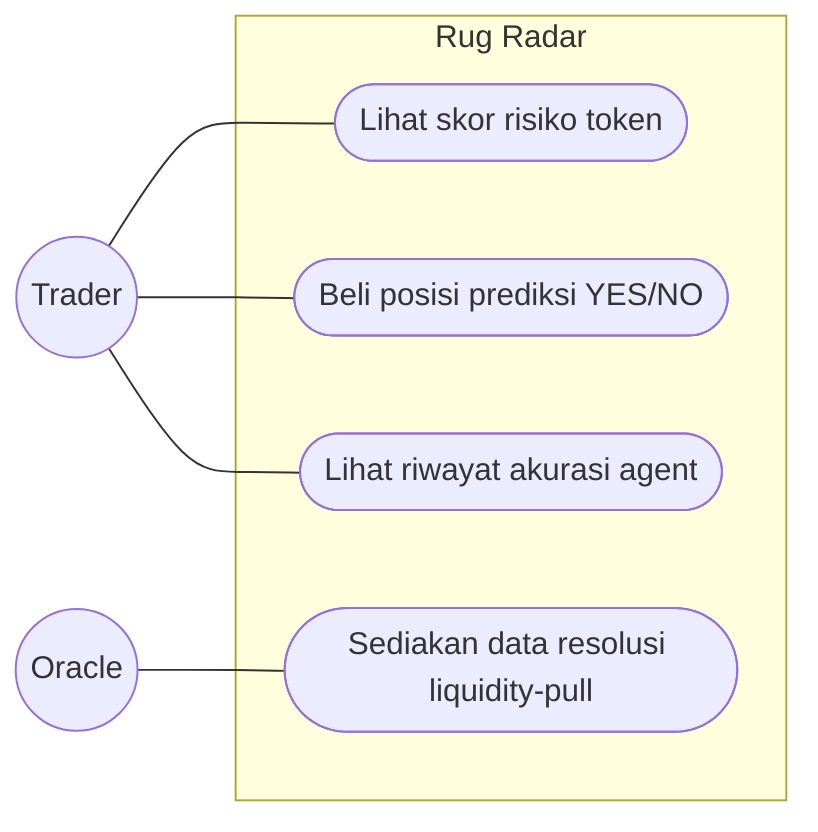
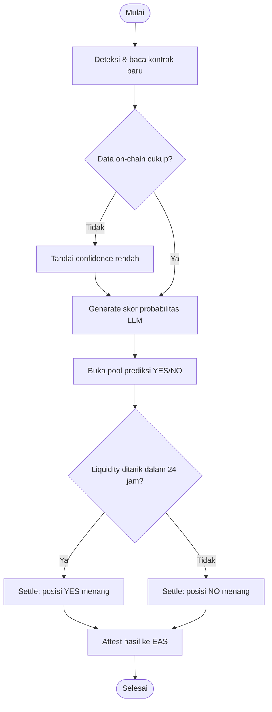
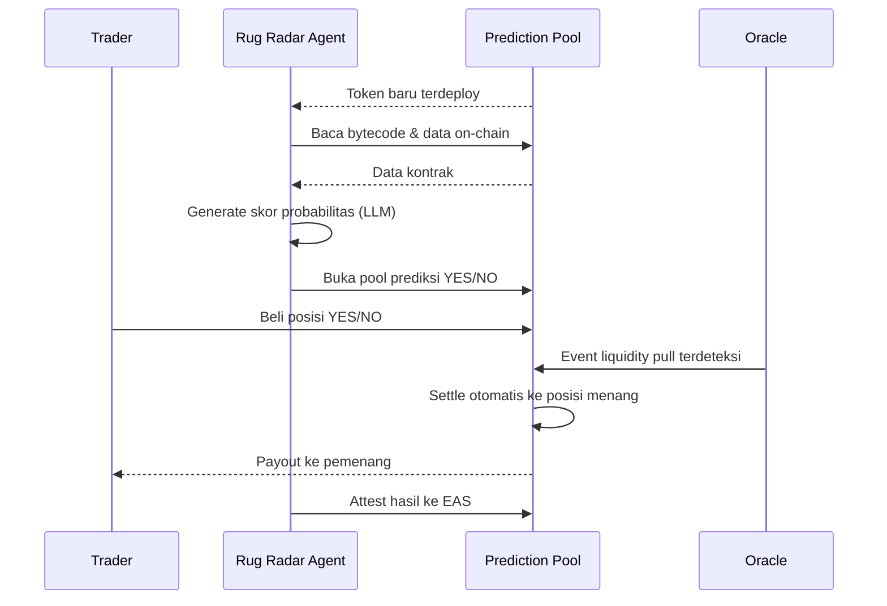
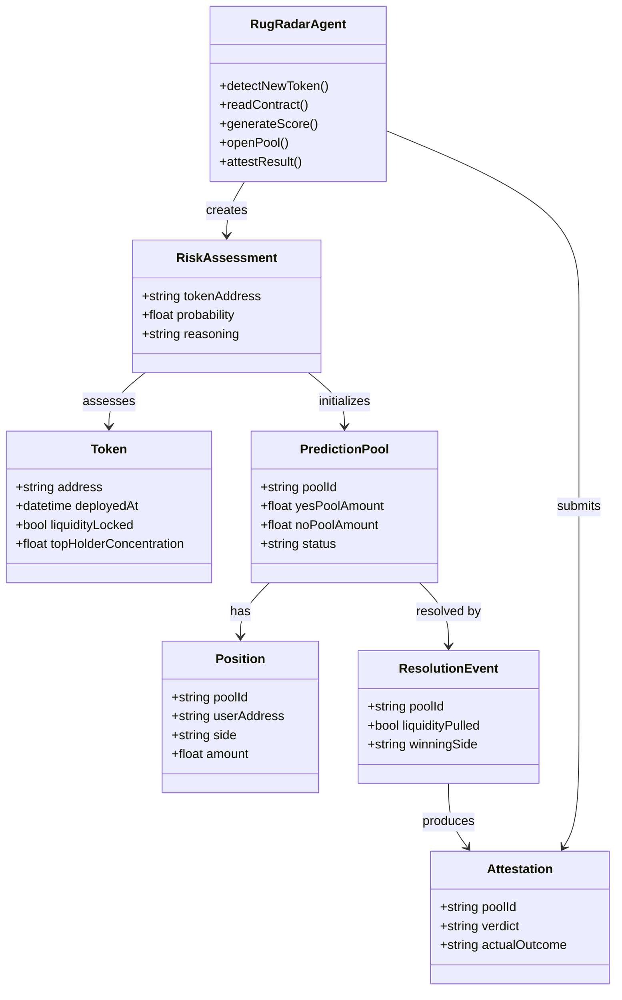

# Rug Radar — UML Diagrams

**Versi:** 1.0
**Tanggal:** 13 Juli 2026
**Terkait:** Rug Radar BRD v1.0, Rug Radar PRD v1.0

Dokumen ini berisi empat diagram UML untuk Rug Radar: use case diagram, activity diagram, sequence diagram, dan class diagram. Semua diagram ditulis dalam sintaks Mermaid sehingga langsung ter-render di GitHub, VS Code, Typora, dan sebagian besar viewer markdown modern.

---

## 1. Use Case Diagram

Menunjukkan siapa berinteraksi dengan sistem dan untuk apa. Actor **Trader** memakai tiga use case utama (melihat skor risiko, membeli posisi prediksi, melihat riwayat akurasi). Actor **Oracle** hanya menyuplai satu data penting — event penarikan liquidity — yang dipakai sistem untuk resolusi otomatis; Oracle tidak pernah menyentuh dana atau keputusan.

*(Mermaid tidak punya tipe use case diagram native, sehingga direpresentasikan sebagai flowchart dengan subgraph sebagai batas sistem — pendekatan umum untuk dokumentasi use case dalam markdown.)*

---

## 2. Activity Diagram

Alur proses dari deteksi token baru sampai settlement. Ada dua titik keputusan: yang pertama menangani kasus token yang datanya belum cukup (fallback ke skor confidence rendah, tetap lanjut jalan agar tidak macet), yang kedua adalah keputusan settlement sebenarnya berdasarkan event on-chain — bukan opini agent.

---

## 3. Sequence Diagram

Interaksi antar komponen dari waktu ke waktu. Agent tidak pernah mengeksekusi settlement secara langsung — dia hanya membaca dan mengumumkan (buka pool, attest hasil), sementara settlement adalah aksi internal Prediction Pool sendiri, dipicu murni oleh event dari Oracle.

---

## 4. Class Diagram

Struktur data yang mendasari sistem. `RiskAssessment` menjadi jembatan penting — mengikat pembacaan kontrak (`Token`) ke pembukaan pool (`PredictionPool`), sementara `ResolutionEvent` dan `Attestation` mencatat apa yang benar-benar terjadi setelahnya, bukan sekadar apa yang diprediksi agent.

